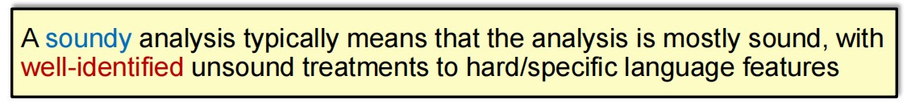
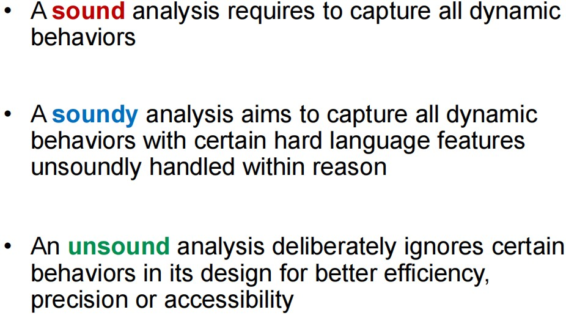
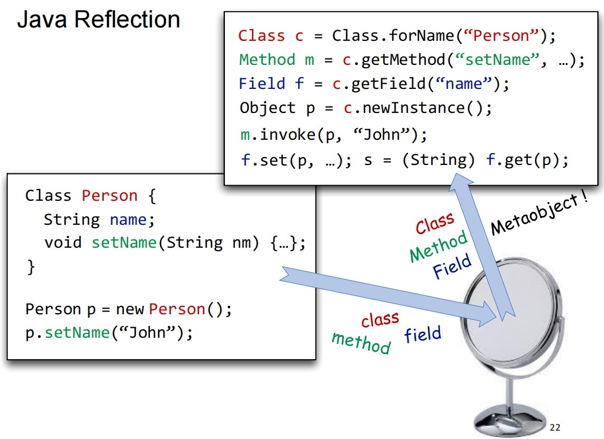
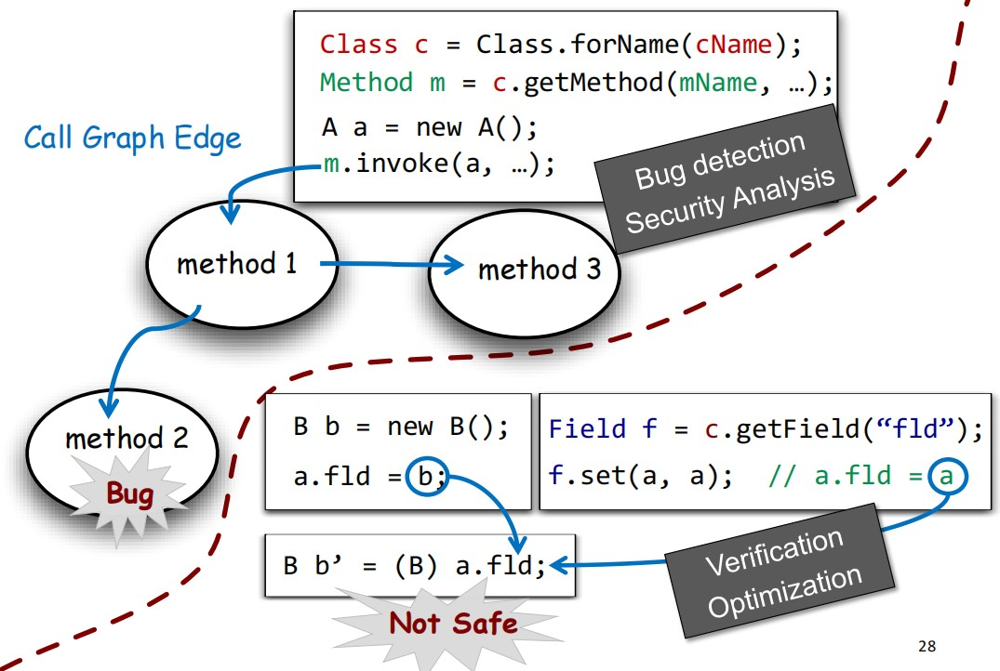
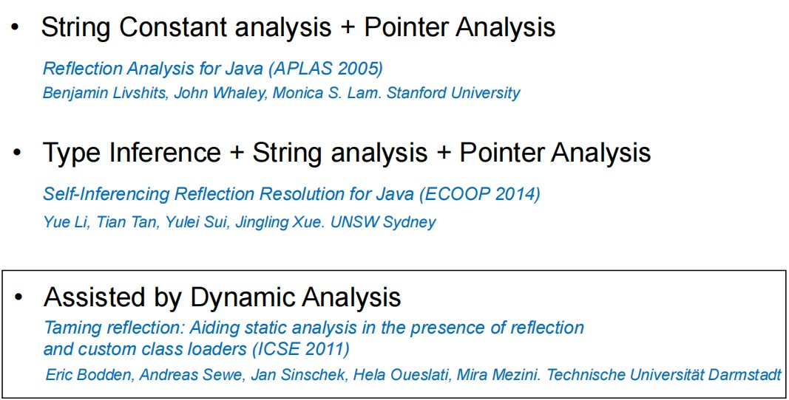
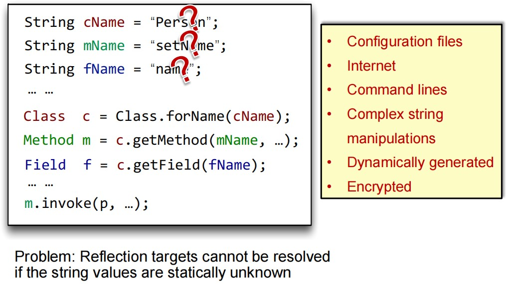
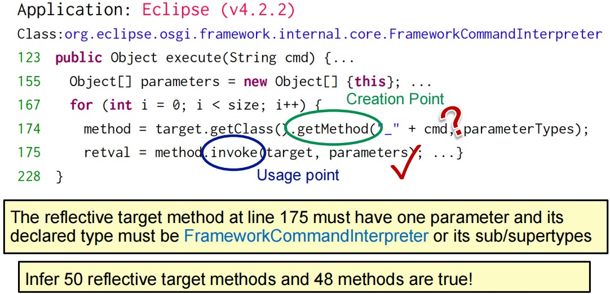
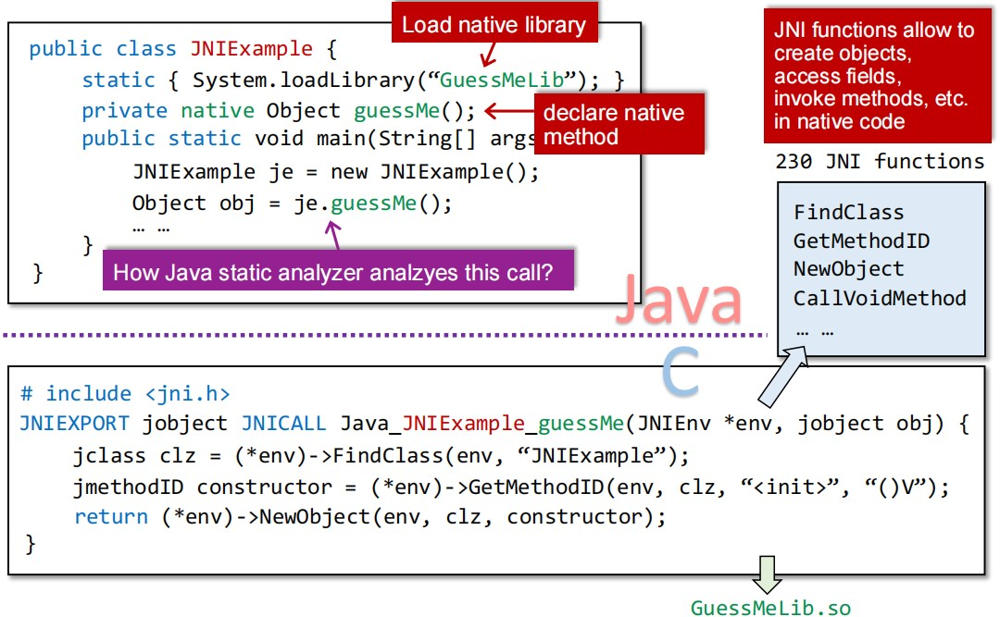
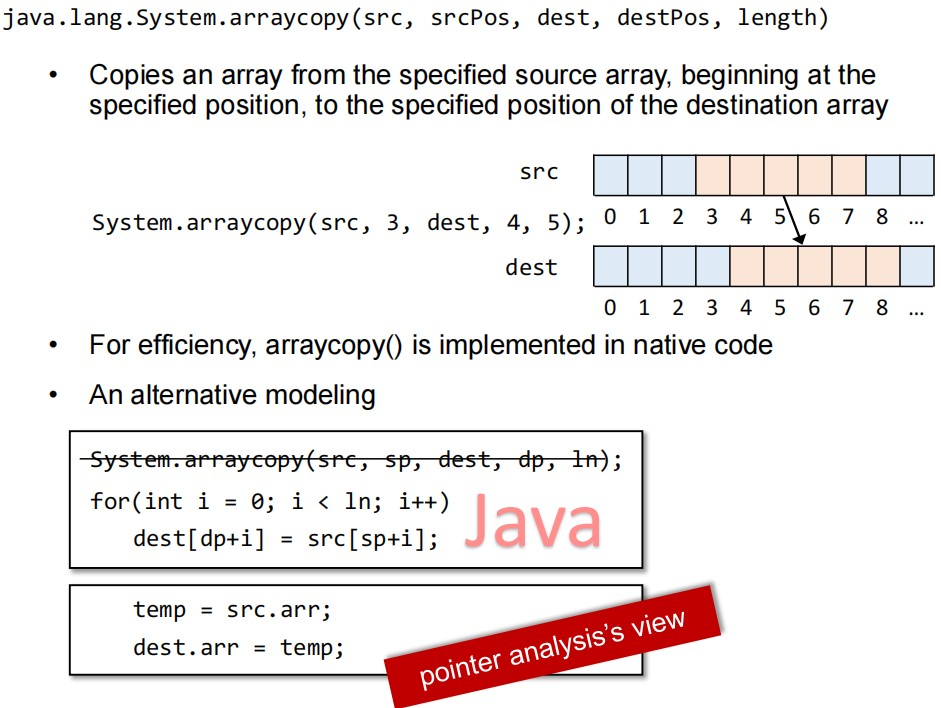

## Soundness & Soundiness

前面我们提到的Sound作为一种保守的原则，其期望能够覆盖程序的所有可能执行状态，但是在应用到实际的全程序时，结果往往是unsound的。这就和我们前面讲到的over-approximation原则相矛盾，难道结果不应该是绝对Sound的吗？

原因在于`Hard Language Feature`的存在：

* Java

  Reflection, native code, dynamic class loading, etc.

* JavaScript

  eval, document object model (DOM), etc.

* C/C++

  Pointer arithmetic, function pointers, etc

针对这些Hard-to-analyze features，如果我们强行使用Sound的原则，很有可能会导致静态分析器无法得到结果，或者即使得到结果也是过于不精确的，因此没有任何意义。所以对于这些语言特性，我们只能选择作出一些Unsound的决定。

这导致很多宣称是Sound的静态分析器一般只是有一个sound core，其对于大部分语言特性都可以做到over-approximation，但是对于HLF只能做到under-approximation。而且在研究中，研究者通常只把重心放在前者上，对于其解决方案在HLF的行为往往会进行忽略，或者只是稍微提一嘴。这种对HLF的刻意忽略往往会对分析结果造成较大的不良影响：

* 对于non-expert：一般会误以为这些分析器的结果就是Sound的，从而对结果过于信任。
* 对于expert：由于作者没有对静态分析器在HLF上行为的解释，即使是专家也很难对分析结果作出定性研究（结果究竟有多Sound、效率如何）

因此为了描述这种针对大多数语言特性都Sound，但是允许对HLF可以Unsound的特征被描述为Soundiness（实际上就是一种迫不得已的条件放松，而非有意的）：

## Reflection

### 什么是反射？

反射实际上是一种方便Java语言运行的机制，其只有三种meta-object，完成了类型与具体的实体之间的解耦，可以更好的运行。是一种运行时体现的动态语言特性。

这种解耦就导致很多值其实是动态变化的，很难在静态分析时被捕捉到。

### 我们为什么非得分析反射？

一方面，你不直面反射特性，很多方法的指向结果你是判断不出来的，比如下图中的m方法，由于mName是动态的，很难直接判断m的指向结果是什么；另一方面，其也会导致一些变量的指向结果判断不出来，导致类型转化错误。总之，不直面反射特性，很多变量的指向结果你就判断不出来，这就会导致一系列问题。

### 如何分析反射？

第一个方法最为粗鲁，在参量都是字符串常量时，我们直接使用指针分析就能得到反射代码中对应变量的指向结果，但是问题就在于很多时候字符串并不是常量，这就会导致指向关系求解不出来。

第二种方法的思想也很简单，参量字符串的值不是不知道吗，虽然我们不能在方法的创建处直接推断出对应方法的指向结果，但是我们可以在方法的使用处，根据其接收参量的特征（个数、类型）来推断出其可能的指向结果。

第三种方法就是结合动态分析辅助推断，但是由于动态分析（比如动态符号执行）的路径不完全性，最终的结果往往是Unsound的，精度比较低。

## Native Code

### 什么是Native Code？

为了使Java具有跨平台的特性，在调用需要和OS交互的Java方法时，往往需要使用到Native标识的方法，其声明在Java文件中，但是方法体却编写在本地的C/C++文件中，两者通过JVM中的JNI进行交互。

### Java Native Interface (JNI)

通过JNI，我们可以使得：

* 语言具有平台独立性，与OS进行交互的脏活累活都由JNI去做了。
* 可以复用现有的library（大部分是用C/C++写成的）。

### 为什么Native Code难以分析？

原因很简单，就是Native Code的行为逻辑一般写在本地的.dll/.so文件中，静态分析不知道它做的是什么。

### 如何处理Native Code？

现在最常用的方法就是人工对常用的Native Code进行建模，根据其语义为其编写对应的Java代码：

> 最近也有一些工作通过分析Binary Code来处理这个问题：*Identifying Java Calls in Native Code via Binary Scanning (ISSTA 2020)* *George Fourtounis, Leonidas Triantafyllou, Yannis Smaragdakis,, University of Athens*